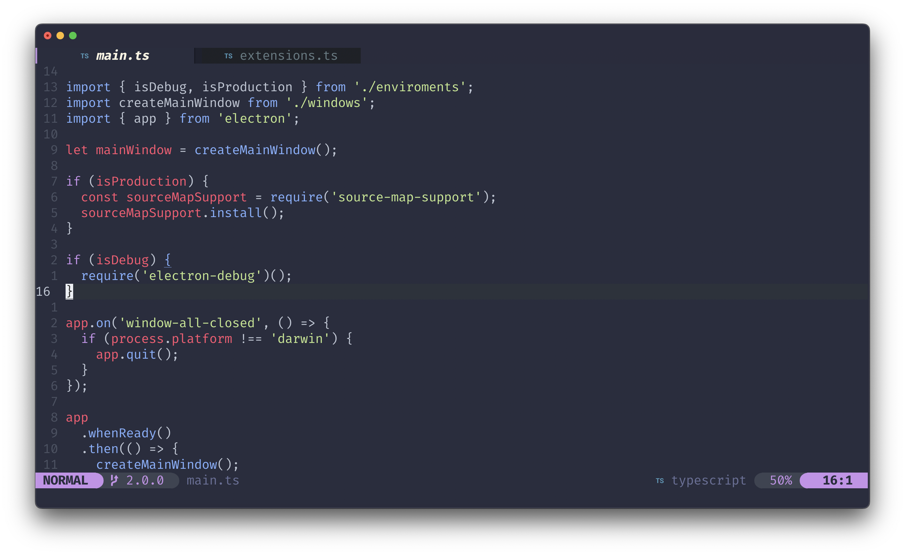

<div align="center" >
    
</div>
<h1 align="center">ChinerNvim</h1>

<h4 align="center">
  <a href="#-features">✨ Features </a>
  ·
  <a href="#%EF%B8%8F-installation"> 🛠️ Installation </a>
  ·
  <a href="#-others"> ➕ Others </a>
</h4>

<p align="center">
A out-of-the-box neovim configuration for react and web technologies.
</p>




# ✨ Features
- Language server protocol built-in
- Prettier formatter by default 
- Git integration
- File explorer
- Telescope for finding
- Syntax highlighting

# 🛠️ Installation

### ✋ Requirements
- [Nerd Fonts](https://www.nerdfonts.com/font-downloads)
- [Neovim 0.8 or higher](https://github.com/neovim/neovim/releases/tag/v0.8.0)

### ⚡ Quick Start
```bash
# Move to .config directory
$ cd ~/.config

# Back up our current config (Recommended)
$ cp -r nvim nvim.backup

# Clone repository
$ git clone https://github.com/pauchiner/chiner.nvim ~/.config/nvim

# Run, when all plugins are installed, reload it 
$ nvim
```

# ➕ Others
- [⌨️ Keybindings](#%EF%B8%8F-keybindings)
  - [Buffers](#buffers)
  - [Browser](#browser)
  - [Windows](#windows)
  - [Language Server Protocol](#language-server-protocol)
- [🐈 Startup Screen](#-startup-screen)
- [🎨 Color Schemes](#-color-schemes)
  - [Lualine Theme](#lualine-theme)
  - [Bufferline Colors](#bufferline-colors)
- [🦋 Prettier](#-prettier)
  - [Configure](#-configure-prettier)
  - [🚫 Disable format on save](#-disable-format-on-save)
- [Lsp configuration](#lsp-configuration)
- [Git Integration](#git-integration)
- [Credits](#credits)


# ⌨️ Keybindings

### Buffers

|  Function       |  keybind      |
|-----------------|---------------|
| Buffer Next     |`<tab>`        |
| Buffer Previous |`<Shift> <tab>`|
> Change buffers keybindings [here](https://github.com/pauchiner/chiner.nvim/blob/2da1a326eec18cf105a8d24d18d1c657cfe33c88/after/plugin/bufferline.rc.lua#L35)

### Browser

|  Function            |  keybind      |
|----------------------|---------------|
| Toggle Nerdtree      |     `;l`      |
| Toggle quick find    |     `;f`      |
| Show lsp diagnostics |     `;e`      |
| Show buffers list    |     `\\`      |
| Command help list.   |     `;t`
> Change Browser keybindings [here](https://github.com/pauchiner/chiner.nvim/blob/2da1a326eec18cf105a8d24d18d1c657cfe33c88/after/plugin/telescope.rc.lua#L54)

### Windows


|  Function             |  keybind          |
|-----------------------|-------------------|
| Split vertical        |    `sv`           |
| Split horizontal      |    `ss`           |
| Move to left window   | `sh` or `s <left>`| 
| Move to right window  |`sl` or `s <right>`|  
| Move to the up window |`sk` or `s <up>`   |  
| Resize to left   |`sj` or `s <down>` |  
| Move to left window   | `sh` or `s <left>`| 
| Move to right window  |`sl` or `s <right>`|  
| Move to the up window |`sk` or `s <up>`   |  
| Move to down window   |`sj` or `s <down>` |
> Change Windows keybindings [here](https://github.com/pauchiner/chiner.nvim/blob/2da1a326eec18cf105a8d24d18d1c657cfe33c88/lua/maps.lua#L17)

### Language Server Protocol

|  Function                    |  keybind         |
|------------------------------|------------------|
| Rename                       |   `gr`           |  
| Hover doc                    |   `K`            |
| Lsp finder                   |   `gd`           |
| Peek Definition              |   `gp`           | 
| Jump to next diagnostic      |   `<Ctrl> j`     |
> Change LSP keybindings [here](https://github.com/pauchiner/chiner.nvim/blob/main/plugin/lspsaga.rc.lua)

# 🐈 Startup Screen
🏗️ Content here comming soon...

# 🎨 Color Schemes

This configuration uses [Palenight Color Scheme](https://github.com/drewtempelmeyer/palenight.vim).

You can change the theme installing a new one and changing inside [/lua/colorscheme.lua](https://github.com/pauchiner/chiner.nvim/blob/2f1745f4a0bb62b4319f1f452e3c085b679dcfdb/lua/colorscheme.lua#L2) this line:

```lua
local colorscheme = "Your new color scheme"
```
## Lualine Theme
Lualine also have his own [themes](https://github.com/nvim-lualine/lualine.nvim/blob/master/THEMES.md), probably your color scheme is already installed.

To change the lualine theme go to the [after/plugin/lualine.rc.lua](https://github.com/pauchiner/chiner.nvim/blob/main/after/plugin/lualine.rc.lua) and change this:
```lua
...
lualine.setup {
  options = {
    icons_enabled = true,
    theme = 'Your new color scheme',
...
```

## Bufferline Colors
The bufferline doens't follow the global colorscheme but you can change the colors in [after/plugin/bufferline.rc.lua](https://github.com/pauchiner/chiner.nvim/blob/main/after/plugin/bufferline.rc.lua):

```lua
...
highlights = {
    indicator_selected = {
      fg = '#b78fda',
    },
    background = {
      fg = '#657b83',
      bg = '#1e2127'
    },
    buffer_selected = {
      fg = '#fdf6e3',
      bold = true,
    },
    fill = {
      bg = '#2a2c3d'
    }
  },
...
```
> [See all the highlights options](https://github.com/akinsho/bufferline.nvim/blob/3677aceb9a72630b0613e56516c8f7151b86f95c/doc/bufferline.txt#L726)

# 🦋 Prettier
Prettier formatter is enabled by default and it triggers when a file is saved.

## 💱 Configure prettier
By default prettier search a [config file](https://prettier.io/docs/en/configuration.html#configuration-file) in your working directory.

If no has any uses the [default prettier configuration](https://prettier.io/docs/en/configuration.html#basic-configuration).

To override this you can go to the [after/plugins/prettier.rc.lua](https://github.com/pauchiner/chiner.nvim/blob/main/after/plugin/prettier.rc.lua) and pass the cli_options:
```lua
prettier.setup({
  cli_options = {
    arrow_parens = "always",
    bracket_spacing = true,
    bracket_same_line = false,
    embedded_language_formatting = "auto",
    end_of_line = "lf",
    html_whitespace_sensitivity = "css",
    -- jsx_bracket_same_line = false,
    jsx_single_quote = false,
    print_width = 80,
    prose_wrap = "preserve",
    quote_props = "as-needed",
    semi = true,
    single_attribute_per_line = false,
    single_quote = false,
    tab_width = 2,
    trailing_comma = "es5",
    use_tabs = false,
    vue_indent_script_and_style = false,
  },
})
```

## 🚫 Disable format on save
Go to the [/plugin/null-ls.rc.lua](https://github.com/pauchiner/chiner.nvim/blob/main/plugin/null-ls.rc.lua) and remove the code shown below:
```lua
...
local group = vim.api.nvim_create_augroup("lsp_format_on_save", { clear = false })
local event = "BufWritePre"
local async = event == "BufWritePost"

null_ls.setup({
  -- Delete all code inside this function
})
...
```

# Git Integration
🏗️ Content here comming soon...

# Lsp Configuration
🏗️ Content here comming soon...

# Credits


This vim workflow is forked from [craftzdog](https://github.com/craftzdog/dotfiles-public) dotfiles. Thanks! 🙏
