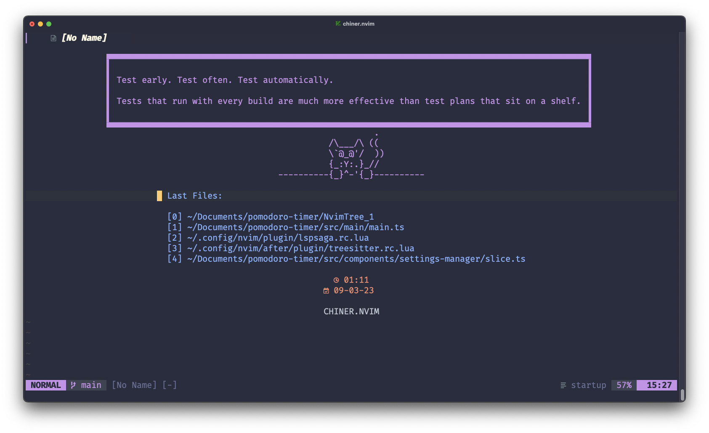

# chiner.nvim

A out-of-the-box neovim configuration for react and web technologies.

- Written in Lua

- Uses packer for plugins
- Easy keboard shortcuts




- [Quick Start](#quickstart)
- [Usage](#Usage)
  - [Keybindings](#keybindings)
  - [Color Scheme](#colorscheme)
- [Credits](#credits)


# Quick Start

```bash
# Move to .config directory
cd ~/.config

# Back up our current config (Recommended)
cp -r nvim nvim.backup

# Clone repository
git clone https://github.com/pauchiner/chiner.nvim ~/.config/nvim
```
## Installing the plugin manager
This neovim config uses [Packer](https://github.com/wbthomason/packer.nvim) as plugin manager.

Follow the [Quick Install Guide](https://github.com/wbthomason/packer.nvim#quickstart) to install it.

## Keybindings

### Buffers

|  Function       |  keybind      |
|-----------------|---------------|
| Buffer Next     |`<tab>`        |
| Buffer Previous |`<Shift> <tab>`|

### Browser

|  Function            |  keybind      |
|----------------------|---------------|
| Toggle Nerdtree      |     `;l`      |
| Toggle quick find    |     `;f`      |
| Show lsp diagnostics |     `;e`      |
| Show buffers list    |     `\\`      |
| Command help list.   |     `;t`

### Windows


|  Function             |  keybind          |
|-----------------------|-------------------|
| Split vertical        |    `sv`           |
| Split horizontal      |    `ss`           |
| Swap windows          |   `space`         |
| Move to left window   | `sh` or `s <left>`| 
| Move to right window  |`sl` or `s <right>`|  
| Move to the up window |`sk` or `s <up>`   |  
| Move to down window   |`sj` or `s <down>` |  


To see all check [maps.lua](https://github.com/pauchiner/chiner.nvim/blob/main/lua/maps.lua).

## Color Scheme

This configuration uses [One Color Scheme](https://github.com/joshdick/onedark.vim).

# Credits


This vim workflow is forked from [craftzdog](https://github.com/craftzdog/dotfiles-public) dotfiles. Thanks! 🙏
