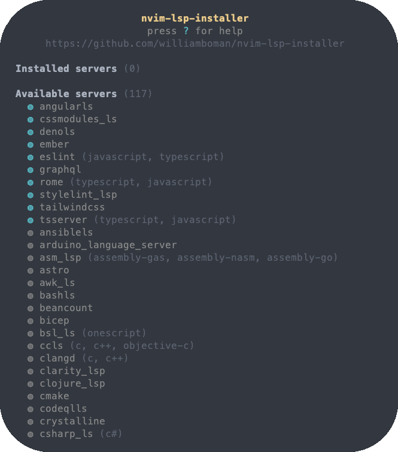
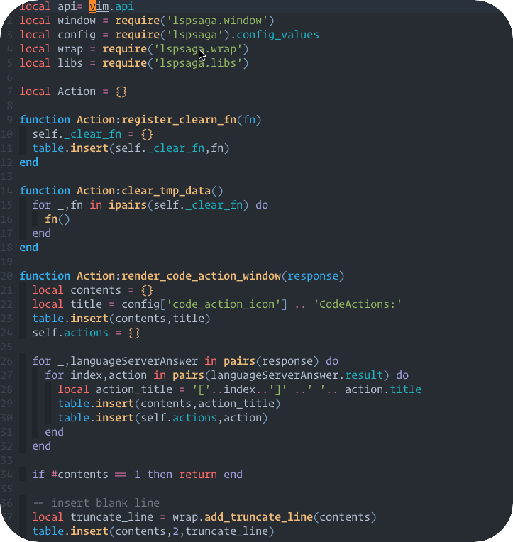
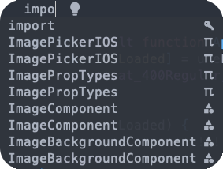
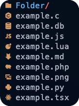

# My vim setup

Simple neovim setup with colors and lsp.


Requires [Neovim ](https://neovim.io) v0.5 at least.

---
# Installation
> ⚠ Make sure than you have a backup of your nvim configuration before install.

Run this command on a terminal:
```shell
git clone https://github.com/pauchiner/chiner.nvim ~/.config/nvim
```
Or [download the repository](https://github.com/pauchiner/chiner.nvim/archive/refs/heads/main.zip) and copy the folder on your config directory.

# Installing the plugin manager

This neovim config uses [vim-plug](https://github.com/junegunn/vim-plug) as plugin manager.


# Plugins:

All of the plugins of the configuration file are here:

## [nvim-lspconfig](https://github.com/neovim/nvim-lspconfig)

The neovim built-in lsp client with some plugins.


## [nvim-lsp-installer](https://github.com/williamboman/nvim-lsp-installer)

Neovim plugin that allows you to seamlessly manage LSP servers with :LspInstall.




## [lspsaga.nvim](https://github.com/tami5/lspsaga.nvim)

Is a light-weight lsp plugin based on neovim built-in lsp with highly a performant UI.




## [lsp-colors.nvim](https://github.com/folke/lsp-colors.nvim)

Plugin that creates missing LSP diagnostics highlight groups for color schemes.


## [lsp-kind](https://github.com/onsails/lspkind.nvim)

Pictograms for neovim built-in lsp.



## [vim-devicons](https://github.com/ryanoasis/vim-devicons)

Adds file type icons to Vim plugins.




[vim-startify](https://github.com/mhinz/vim-startify)

[lualine.nvim](https://github.com/nvim-lualine/lualine.nvim)

[specs.nvim](https://github.com/edluffy/specs.nvim)

[nvim-treesitter](https://github.com/nvim-treesitter/nvim-treesitter)

[cmp-buffer](https://github.com/hrsh7th/cmp-buffer)

[nvim-cmp](https://github.com/hrsh7th/nvim-cmp)

[nvim-web-devicons](https://github.com/kyazdani42/nvim-web-devicons)

[nerdtree](https://github.com/preservim/nerdtree)

[nvim-bufferline.lua](https://github.com/akinsho/bufferline.nvim)

[vim-fugitive](https://github.com/tpope/vim-fugitive)

[LuaSnip](https://github.com/L3MON4D3/LuaSnip)

[vim-prettier](https://github.com/prettier/vim-prettier)

[nvim-ts-autotag](https://github.com/windwp/nvim-ts-autotag)

[vim-rhubarb](https://github.com/tpope/vim-rhubarb)

# Credits


This vim workflow is forked from [craftzdog](https://github.com/craftzdog/dotfiles-public) dotfiles. Thanks! 🙏

