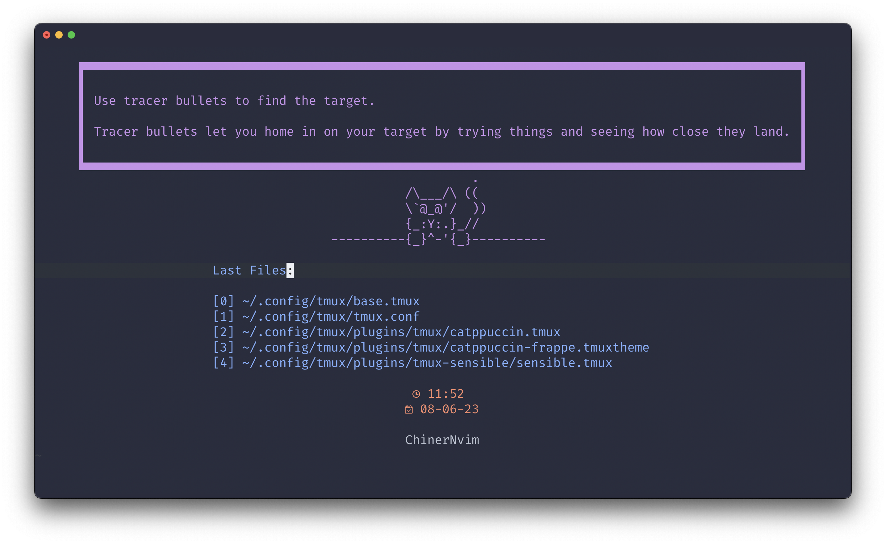
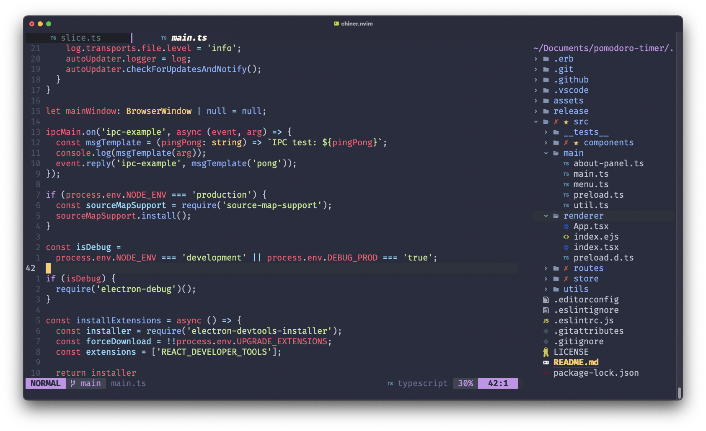

<div align="center" >
    
</div>
<h1 align="center">ChinerNvim</h1>
    
<h4 align="center">
  <a href="https://pauchiner.github.io/ChinerNvim/#-features">✨ Features </a>
  ·
  <a href="https://pauchiner.github.io/ChinerNvim/#%EF%B8%8F-installation"> 🛠️ Installation </a>
  ·
  <a href="https://pauchiner.github.io/ChinerNvim/documentation/keybindings"> 📄 Docs </a>
</h4>

<p align="center">
A out-of-the-box neovim configuration for react and web technologies 🌐
</p>





# ✨ Features
- Language server protocol built-in
- Prettier formatter by default 
- Git integration
- File explorer
- Telescope for finding
- Syntax highlighting

# 🛠️ Installation

### ✋ Requirements
- [Nerd Fonts](https://www.nerdfonts.com/font-downloads)
- [Neovim 0.8 or higher](https://github.com/neovim/neovim/releases/tag/v0.8.0)

### ⚡ Quick Start
```bash
# Move to .config directory
$ cd ~/.config

# Back up our current config (Recommended)
$ cp -r nvim nvim.backup

# Clone repository
$ git clone https://github.com/pauchiner/chiner.nvim ~/.config/nvim

# Run, when all plugins are installed, reload it 
$ nvim
```

# 🧑‍🤝‍🧑 Contributing

All contributions are welcome:

[CONTRIBUTING.md](https://github.com/pauchiner/ChinerNvim/blob/main/.github/CONTRIBUTING.md)

[CODE_OF_CONDUCT.md](https://github.com/pauchiner/ChinerNvim/blob/main/.github/CODE_OF_CONDUCT.md)
